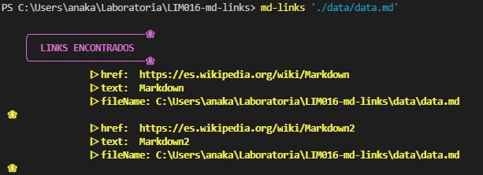
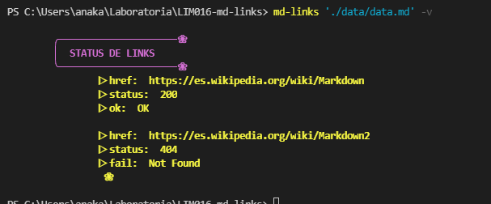
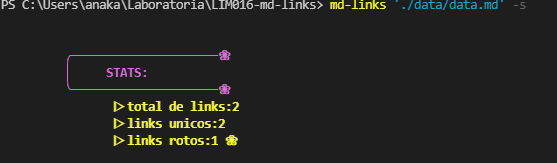
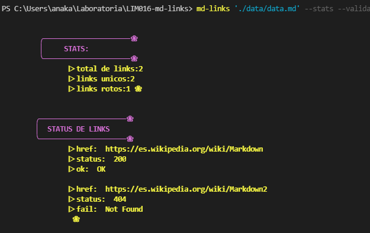

# Markdown Links &#127800;
Es una librería que sirve para devolver el número de enlaces que contiene un archivo MD, permitiendo ver a su vez  estadísticas sobre:

- total de links.
- links únicos. 
- links rotos.

## ✔️1. Instalación
Mediante npm:

 &#10004; npm i anakarina-links

## ✔️2. Guia de uso

Esta aplicación se puede ejecutar a través de la terminal:

md-links <path-to-file> [options]

### ejemplo:

`md-links <ruta>` 

### Options

`md-links <ruta> [options]`

--validate o -v

 - validara cada link dentro del archivo.
 - obtiene ruta del archivo href.  
 - mensaje de OK o FAIL. 
 - estado del link y texto.

 

 --stats o -s

 - para obtener el total de links. 
 - cantidad de links únicos. 
 - links rotos.

 
 

 --validate --stats 

 - podras tener toda la informacion junta.

 

## ✔️3. Autora

Ana karina González López.&#128151;

